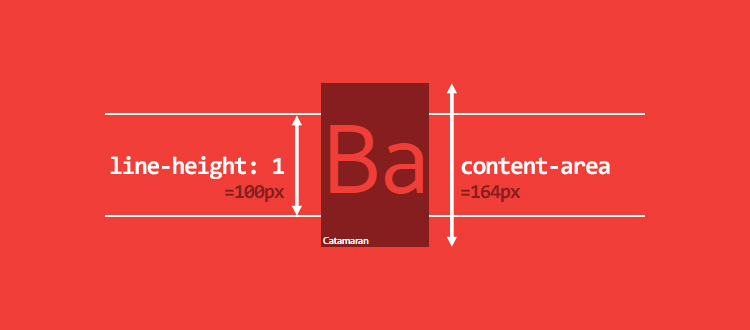

# font-offset

This is a library which used for calculating the vertical offset of the font based on its metrics.

## Usage

```javascript
const openSansMetrics = {
  ascender: 2189,
  descender: -600,
  unitsPerEm: 2048,
  sCapHeight: 1462
};

const { top: topOffset, bottom: bottomOffset } = getOffset(openSansMetrics);
```

Here is an online demo which demostrates how to draw the lines perfectly attach to the edges of charactors:
[CodeSandBox](https://codesandbox.io/s/modest-hofstadter-pdbs1?file=/src/index.js:540-903)

## Explanation

The font's basic metrics are like this picture shows:


- ascender: from `base line` to `ascender line`
- descender: from `base line` to `descnder line`
- sCapHeight: from `base line` to `cap line`
- unitsPerEm: specifies the number of coordinate units on the "em square".

Every font has its own metrics. They are different from other fonts'.

This picture explain how font actually is rendered in browser:


The `content-area` is the height from `ascender line` to `descnder line`.

When we set `line-height` equals `font-size` which is `1em` or `100px`, it doesn't mean the `content-area` which is distance from `ascender line` to `descnder line` is 100px heigh. The `content-area` block may over the size of `line-height` block; There may have overflow parts, but this overflow parts are evenly distributed on top and bottom. 

So the final calculation is:
```javascript
const bodyHeight = ascender - descender;
const halfOverflow = (bodyHeight - unitsPerEm) / 2;
const bottom = (- descender - halfOverflow) / unitsPerEm;
  const top = (ascender - sCapHeight - halfOverflow) / unitsPerEm;
```


