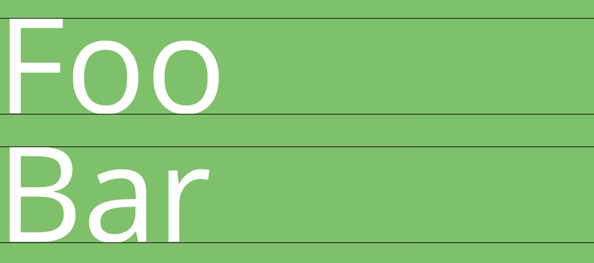

# font-offset

This is a library which used for calculating the vertical offset of the font based on its metrics.

## Usage

```javascript
const openSansMetrics = {
  ascender: 2189,
  descender: -600,
  unitsPerEm: 2048,
  sCapHeight: 1462
};

const { top: topOffset, bottom: bottomOffset } = getOffset(openSansMetrics);
```

Here is an online demo which demostrates how to draw the lines perfectly attach to the edges of charactors:
[CodeSandBox](https://codesandbox.io/s/modest-hofstadter-pdbs1?file=/src/index.js:540-903)



## Explanation

Every font has its own metrics. They are different from other fonts'. Generally, the font's ascender/descender are like this picture shows:


- ascender: from `base line` to `ascender line`
- descender: from `base line` to `descnder line`
- sCapHeight: from `base line` to `cap line`
- unitsPerEm: specifies the number of coordinate units on the "em square".

But for metrics of font, ascender/descender are different from general ones. 

Take the example of `Catamaran`, 

- generals Ascent/Descent: ascender is 770 and descender is 230. Used for character drawings.
- metrics Ascent/Descent: ascender is 1100 and descender is 540. Used for content-area’s height.

This picture explain how font actually is rendered in browser:


The `content-area` is the height of metric `ascender` plus metric `descnder`.

When we set `line-height` equals to `font-size` which is `1em` or `100px`, it doesn't mean the `content-area` is 100px heigh. The `content-area` block may over the size of `line-height` block; There may have overflow parts, but the overflow are evenly distributed on top and bottom. 

So the final calculation is:
```javascript
const bodyHeight = ascender - descender;
const halfOverflow = (bodyHeight - unitsPerEm) / 2;
const bottom = (- descender - halfOverflow) / unitsPerEm;
const top = (ascender - sCapHeight - halfOverflow) / unitsPerEm;
```


